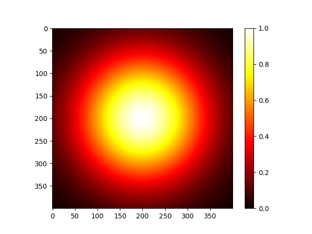
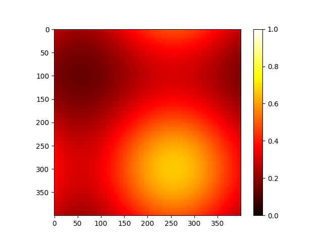
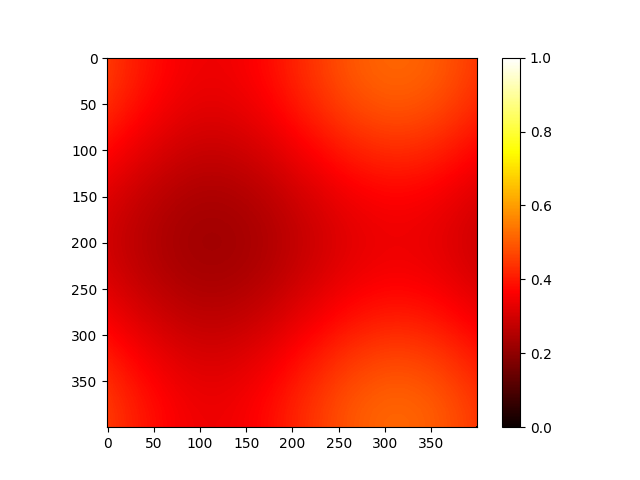

# Project 1 Milestone 1

## Runing the project

```
./run_advecation.sh <N> <NT> <L> <T> <u> <v>
```

for example:
```
./run_advecation.sh 400 20000 1.0 1.0e6 5.0e-7 2.85e-7
```

## 2D Plots

1. Initialization


2. Halfway


3. Termination


