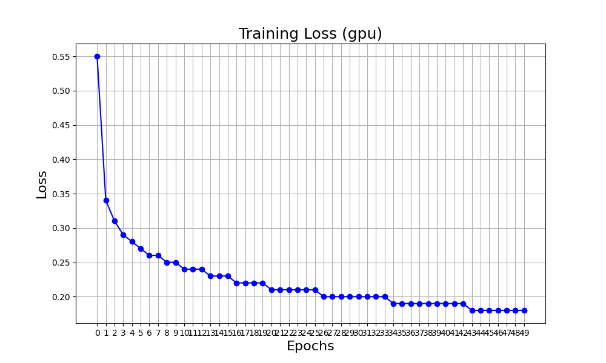
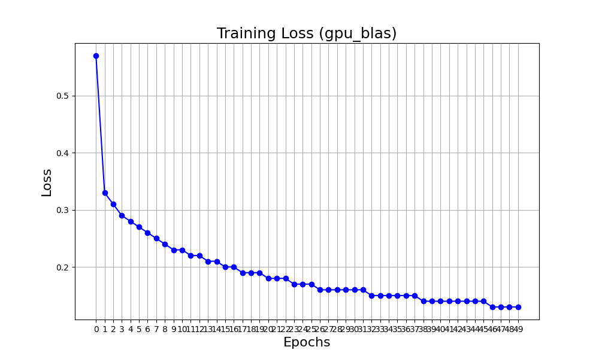
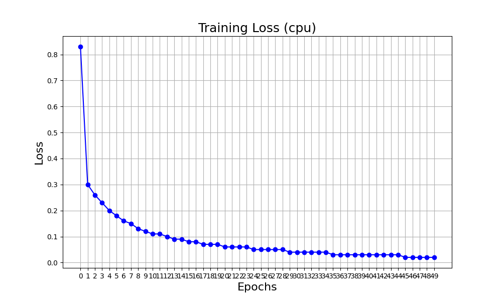
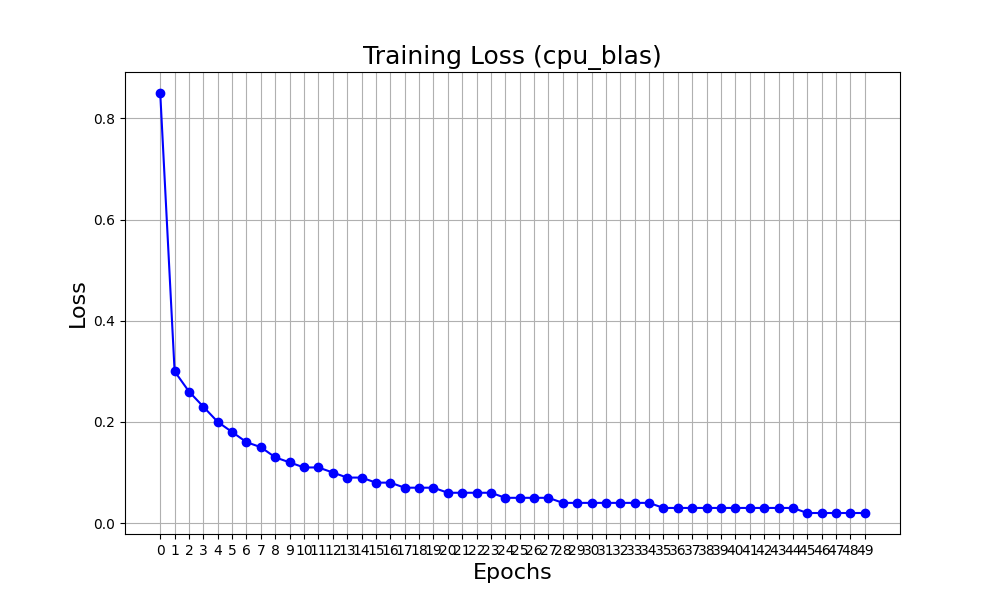

# Project 3

## Milestone 3

+ learning rate: 0.1 (CPU), 0.001 (GPU)
+ epochs: 50
+ GPU threads: 256
+ CPU is tested on MacOS M2
+ GPU is tested on Nvidia A40

Note: Somehow the learning rate of `0.1` doesn't converge (for GPU native), so I have to use `0.001` instead.

Version      | Processor | Accuracy(Training) | Accuracy(Testing) | Grind rate(Training) | Training Time | TPB/cores
|------------|-----------|--------------------|-------------------|----------------------|---------------|-----------|
| GPU native |    A40    |       94.87%       |      93.56%       |       3937.42        |    761.92s    |    256    |
| GPU CuBLAS |    A40    |       96.27%       |      95.41%       |       4045.26        |    741.61s    |    256    |
| CPU native | MacOS M2  |      99.65%        |      97.86%       |        811.40        |   3697.32s    |      1    |
| CPU BLAS   | MacOS M2  |      99.64%        |      97.91%       |        2419.68       |   1239.84     |      1    |

### Training losses

<table>
  <tr>
    <td></td>
    <td></td>
  </tr>
  <tr>
    <td></td>
    <td></td>
  </tr>
</table>


### How to Build?

#### CPU without BLAS

```
make cpu
```

#### CPU with BLAS

```
make blas
```

#### GPU without BLAS

```
make cuda
```

#### GPU with CuBLAS

```
make cuda-blas
```

### How to test?

#### CPU

```
make test-cpu
```

#### GPU

```
make test-cuda
```